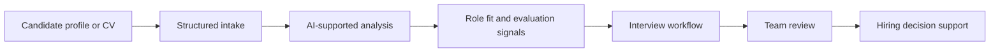
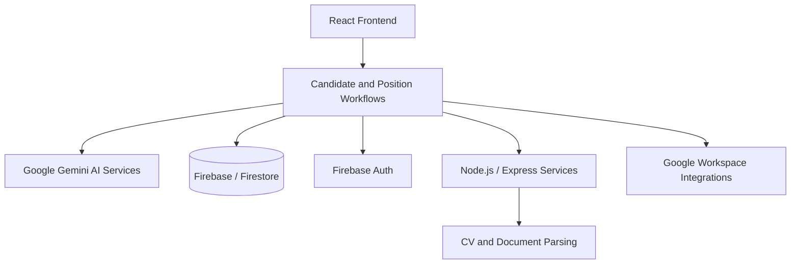

# TalentFlow

> AI-supported recruitment and candidate operations platform for structuring hiring workflows, evaluating candidates, and improving decision quality.

TalentFlow is a product prototype focused on how recruitment teams can move from scattered candidate data and manual follow-ups to a more structured, measurable, and AI-supported hiring workflow.

The goal is not to replace recruiter judgment. The goal is to help teams see the right signals faster, compare candidates more consistently, and keep the hiring process under human control.

---

## Product Snapshot

| Area | What TalentFlow Does |
|---|---|
| Candidate intake | Centralizes candidate profiles, CVs, and application context |
| AI analysis | Supports structured candidate review and scoring |
| Interview workflow | Helps manage interview planning, notes, and follow-up actions |
| Decision support | Makes candidate comparison more consistent and transparent |
| Communication | Supports candidate messaging and follow-up workflows |
| Analytics | Gives visibility into hiring pipeline performance |

---

## Why It Matters

Recruitment workflows often become fragmented across CV files, spreadsheets, emails, meeting notes, and informal team discussions.

That fragmentation creates three product problems:

- decision context gets lost,
- candidate comparison becomes inconsistent,
- operational follow-up depends too much on manual effort.

TalentFlow explores how AI can support recruitment operations by turning unstructured candidate inputs into reviewable signals while keeping the final decision with the hiring team.

---

## Product Flow

---

## Core Capabilities

| Capability | Product Value |
|---|---|
| Candidate profile management | Keeps candidate context in one place |
| CV and document analysis | Turns unstructured inputs into comparable signals |
| AI-supported scoring | Helps teams review candidates with more structure |
| Interview planning | Connects candidate evaluation with scheduling and follow-up |
| Live interview support | Captures interview context and supports real-time review |
| Pipeline analytics | Makes bottlenecks and conversion points easier to see |
| Workspace integrations | Connects hiring workflows with email and calendar actions |

---

## Human-in-the-Loop Design

TalentFlow is designed around the idea that AI should support hiring decisions, not make them alone.

| AI Can Help With | Human Judgment Stays Responsible For |
|---|---|
| Summarizing candidate information | Final hiring decisions |
| Highlighting role-fit signals | Cultural and team fit assessment |
| Structuring interview notes | Interpretation of sensitive context |
| Detecting gaps or risks | Fairness, ethics, and accountability |
| Suggesting next actions | Candidate communication tone and timing |

---

## My Role / Product Perspective

This project reflects my product focus on operational workflows where AI creates value by improving decision quality, not by blindly automating people out of the process.

Key product questions behind TalentFlow:

| Product Question | Design Direction |
|---|---|
| How can candidate review become more consistent? | Use structured AI-assisted evaluation signals |
| How can recruitment teams reduce manual follow-up? | Connect analysis, scheduling, and communication workflows |
| How can AI remain trustworthy in hiring? | Keep outputs explainable and human-reviewed |
| How can teams compare candidates without losing context? | Centralize profiles, interviews, and pipeline data |
| How can hiring operations become measurable? | Surface funnel, response, and process analytics |

---

## Architecture Overview

---

## Technology

| Layer | Stack |
|---|---|
| Frontend | React, Vite, Tailwind CSS, React Router |
| UI / UX | Theme-aware interface, compact dashboard patterns, Lucide icons |
| AI | Google Gemini models |
| Backend | Node.js, Express, Firebase Cloud Functions |
| Data | Firebase Firestore |
| Auth | Firebase Authentication |
| Documents | PDF and document parsing workflows |
| Integrations | Gmail and Google Calendar workflows |
| Analytics | Dashboard and pipeline reporting views |

---

## Current Status

Public product prototype and portfolio project.

TalentFlow is useful as a showcase for AI-supported workflow design, recruitment operations, decision-support UX, and human-in-the-loop product thinking.

---

## Portfolio Context

TalentFlow is part of my broader product focus around:

- AI-supported operational products,
- decision-support systems,
- workflow automation with human control,
- CRM/CX and operations thinking applied to internal business processes,
- turning unstructured inputs into measurable product signals.
